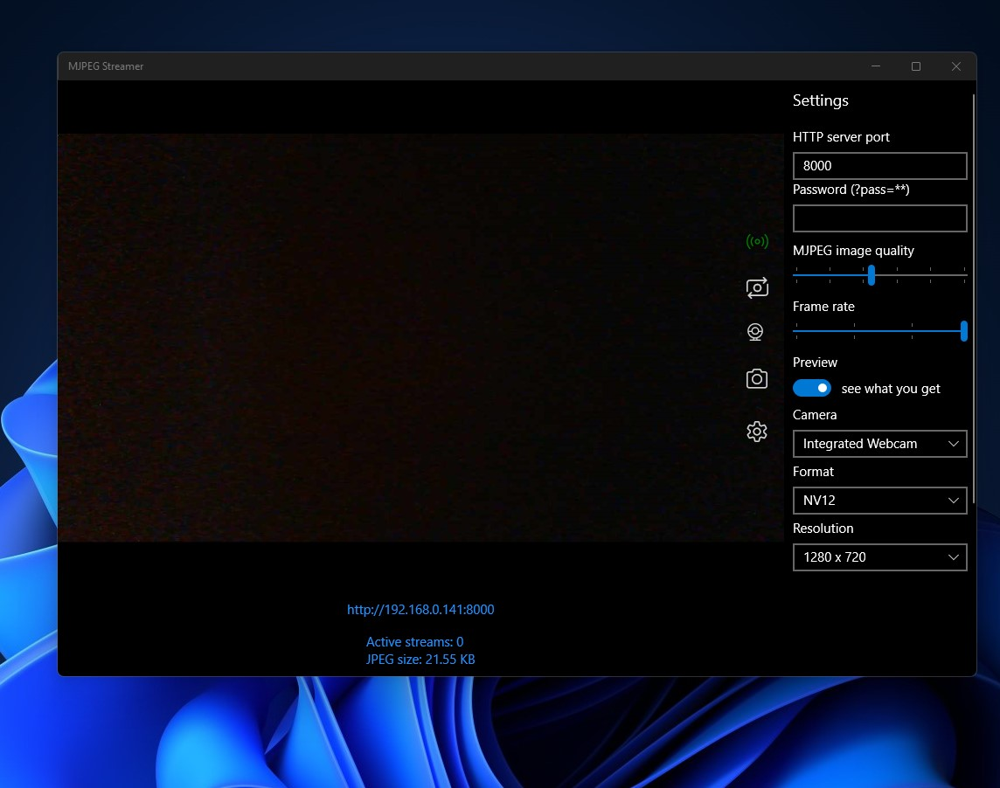

   
  <b>Enhanced MJPEG Streamer (UWP) originally developed by flyinggorilla</b> 
  <a href="./src">Source</a> |
  <a href="https://github.com/flyinggorilla/MJPEG-Streamer-Universal-Windows-App">Original Project</a> 
    
    

# Features

- Enhanced Layout
- Password option
- Frame size info
- Stream link
- Snapshot button
- Bugs fixes

# Target

It will work with build 15063 and above, ARM - x64 - x86

# Credits

Developed by flyinggorilla

Enhanced by Bashar Astifan